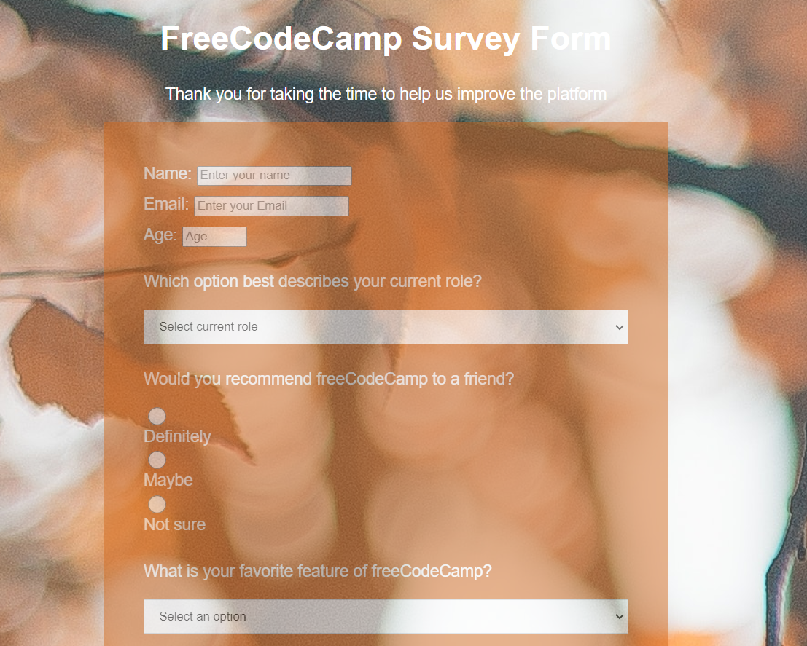

* Documentation is any communicable material that is used to describe, explain or instruct regarding some attributes of an object, system or procedure, such as its parts, assembly, installation, maintenance and use.
* First of all introduct my project i have created personal portfolio it's consists of only one landing page.
* Different classes and id's are used in this project. it is very simple but vendorfull expriance for me.
---
## Elements use in web page : 
1. *First of all we check some details and elements related to **HTML*** .
    * I have use HTML5 for this page.
    * I'm using font-awsome icons.
    * I have created different tags :
        * Elements
            * links
            * header
            * meta
            * div
            * image
            * nav
            * section
            * h2
            * ul
            * li
            * footer
            * span
            * i

---
## Picture : 

---
2. *Now we check some details and elements related to **CSS*** .
    * margins
    * padding 
    * background-colour
    * text-align
    * "#" for calling id's
    * "*" for calling classes
    * height
    * width
    * font-style
    * border
    * position
    * display
    * justify-content
    * font-family
    * transform
    * list-style
    * flex-direction
    * box-shadow
